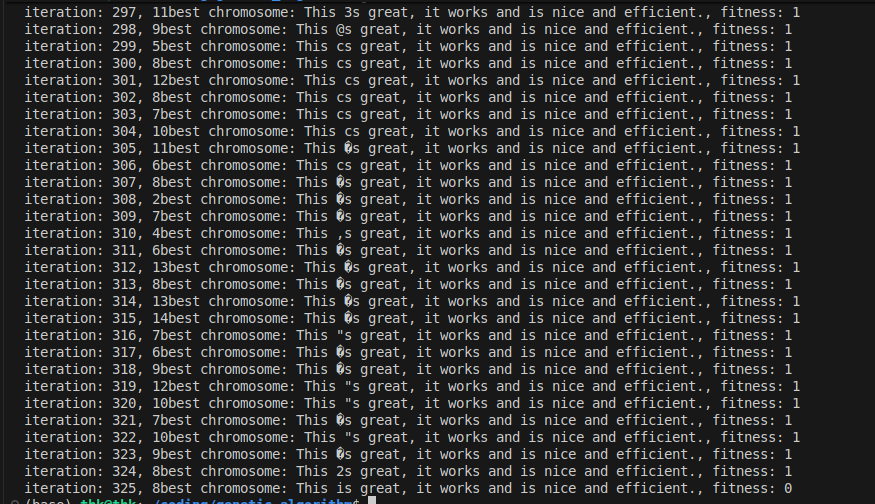

Implementation of the Genetic Algorithm in C++. It works now for finding a string made up of characters from the german keyboard. 

Using g++ to compile, with specifying header files (include) and source files (src/)
<pre>
 g++ -I include -o main src/* 
</pre>

Further improvements / ideas:
- Better memory managment for handling really long strings
- Finding pictures by using R,G,B values
- User input (easy)
- Find solutions to mathematical equations